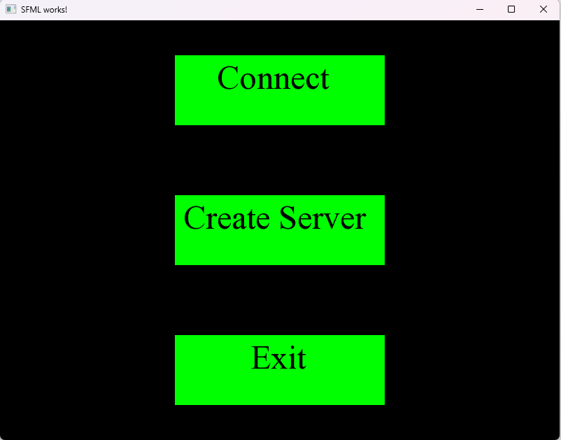
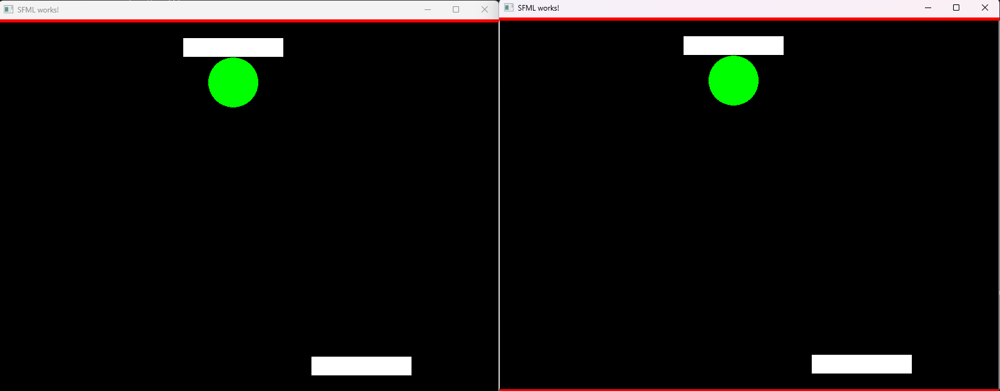

### Ping-pong
This game is implemented based on the TCP protocol. 
After the launch .exe you can join the server, create a server, or exit the game. This is done by keys 1, 2, 3 on the keyboard, respectively. After connecting to the game, control is carried out by the left and right arrows on the keyboard, to launch the ball you need to press the space bar. 
To exit the game, you can press the Q key.
### Screenshots

